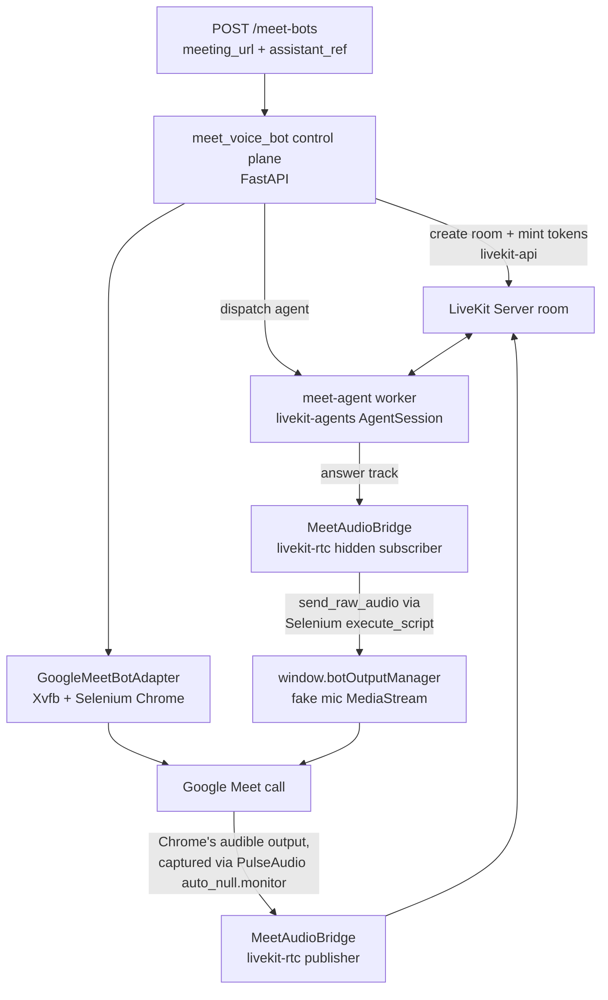

# Meet Voice Bot

A standalone backend that joins a **Google Meet** call as a guest, bridges its audio to a **self-hosted LiveKit** room, and runs a **STT → LLM → TTS** voice agent (`livekit-agents`) that talks back into the call. It implements [`attendee/plan/google_meet_livekit_voice_bot_plan.md`](../attendee/plan/google_meet_livekit_voice_bot_plan.md) end to end.

This system vendors only the Google-Meet-join layer (headed Chrome + Xvfb + CDP) from the [`attendee`](../attendee) reference application, trimmed to be Django-independent. Everything LiveKit-related — room/token minting, agent dispatch, the audio bridge, the voice pipeline — is implemented natively here; **nothing in this repo calls out to attendee's Django app, database, Celery, or MCP servers at runtime.**

## Contents

- [How it works](#how-it-works)
- [Minimal setup (current default: bot-only, LiveKit disabled)](#minimal-setup-current-default-bot-only-livekit-disabled)
- [Repository layout](#repository-layout)
- [Prerequisites](#prerequisites)
- [Setup (Docker Compose)](#setup-docker-compose)
- [Starting a bot](#starting-a-bot)
- [Verifying the Meet → bot audio capture path](#verifying-the-meet--bot-audio-capture-path)
- [Enabling the full LiveKit voice pipeline](#enabling-the-full-livekit-voice-pipeline)
- [Configuration reference](#configuration-reference)
- [Local assistant records](#local-assistant-records)
- [Running without Docker](#running-without-docker-linux-dev-box)
- [Testing](#testing)
- [Diagnostics](#diagnostics)
- [What was ported from `attendee`, and what wasn't](#what-was-ported-from-attendee-and-what-wasnt)
- [Known limitations / follow-ups](#known-limitations--follow-ups)
- [Non-goals](#non-goals)

## How it works



One process per bot, two images:

| Image | Source | What it does | Never contains |
|---|---|---|---|
| **control** (`docker/Dockerfile.meet-voice`) | `meet_voice_bot/` | Runs the HTTP API, canonicalizes the meeting URL, creates the LiveKit room, mints two tokens (publisher + hidden subscriber), explicitly dispatches the agent worker, drives headed Chrome under Xvfb to join Meet as a guest, and bridges audio in both directions. | Any STT/LLM/TTS provider SDK or API key. |
| **agent** (`docker/Dockerfile.agent`) | `meet-agent/` | A `livekit-agents` worker that joins the dispatched room and runs the voice pipeline (`cascade`: plugin STT → OpenAI LLM → plugin TTS, or `pipeline`/`realtime`, selected per assistant record). | Any Chrome/Selenium/Xvfb/PulseAudio code — it never touches Meet directly, only LiveKit room tracks. |

Both images import a third, dependency-free package, **`model_support/`**, so they can never disagree about which `(assistant_mode, provider, model)` combinations are legal.

Audio crosses two different bridges, not one shared loopback:

- **Meet → LiveKit** (what the agent hears): the bot's headed Chrome plays the meeting's audio to PulseAudio's `auto_null` sink (set up by `docker/entrypoint.sh`); `meet_voice_bot/livekit_bridge.py` reads its `auto_null.monitor` source via `parec` and publishes it into the room as the bot's publisher track.
- **LiveKit → Meet** (what the agent says): the agent's answer track is *not* written back into PulseAudio — doing that would feed the bridge's own capture pipeline and make the agent hear itself. Instead `livekit_bridge.py` hands the PCM to `GoogleMeetBotAdapter.send_raw_audio`, which pushes it into a JS-injected fake-microphone `MediaStream` (`window.botOutputManager.playPCMAudio`, in `web_bot_adapter/payload/shared_chromedriver_payload.js`) via Selenium `execute_script`. Chrome then transmits that as the bot's own mic input.

## Minimal setup (current default: bot-only, LiveKit disabled)

The repo currently defaults to a minimal mode: **`LIVEKIT_ENABLED=false`**. In this mode `meet_voice_bot/joiner.py` still does everything up through joining the meeting, but skips the entire LiveKit solution -- `control.RoomController` (room create/token mint/agent dispatch) and `livekit_bridge.MeetAudioBridge` are simply never called. Nothing is deleted or pruned from the code; flip `LIVEKIT_ENABLED=true` (see [Enabling the full LiveKit voice pipeline](#enabling-the-full-livekit-voice-pipeline)) and the full room/token/dispatch/bridge flow runs exactly as before.

In place of the LiveKit bridge, `meet_voice_bot/audio_probe.py`'s `AudioCaptureProbe` runs: it reads the same PulseAudio `auto_null.monitor` source the LiveKit bridge's capture half reads, and logs a running audio level -- so you can confirm, purely from logs, whether the Meet participant's audio is actually reaching the bot's container, with no LiveKit server, no agent, and no provider API keys needed at all.

This is the fastest way to validate: (1) the bot can join a real Meet call as a guest, and (2) the Meet → bot audio *capture* path works, before adding the LiveKit voice pipeline on top.

```bash
docker compose -f docker-compose.minimal.yaml --env-file .env up --build
```

Only `meet-voice` starts (no `livekit`, no `meet-agent`); see [Starting a bot](#starting-a-bot) and [Verifying the Meet → bot audio capture path](#verifying-the-meet--bot-audio-capture-path) below.

## Repository layout

```
hirebot_bot_integration/
├── meet_voice_bot/                  # control image (Meet joiner + LiveKit control plane)
│   ├── main.py                      # FastAPI app: POST /meet-bots, GET/leave, /healthz
│   ├── joiner.py                    # MeetBotSession: per-bot lifecycle orchestration
│   ├── control.py                   # RoomController: room create + token mint + agent dispatch (livekit-api)
│   ├── livekit_bridge.py            # MeetAudioBridge: Pulse capture + fake-mic playback (LIVEKIT_ENABLED=true)
│   ├── audio_probe.py               # AudioCaptureProbe: logs Meet audio level, no LiveKit (LIVEKIT_ENABLED=false, default)
│   ├── meet_url.py                  # Google Meet URL canonicalizer + multi-URL guard
│   ├── assistant_store.py           # loads assistants/*.yaml via model_support
│   ├── config.py                    # Settings, read from environment
│   ├── models.py                    # BotSession / BotStatus
│   ├── web_bot_adapter/             # vendored, trimmed from attendee/bots/web_bot_adapter/
│   └── google_meet_bot_adapter/     # vendored, trimmed from attendee/bots/google_meet_bot_adapter/
├── meet-agent/                      # agent image (livekit-agents voice pipeline worker)
│   ├── agent_run.py                 # WorkerOptions entrypoint (`python agent_run.py dev|start`)
│   ├── session_cfg.py               # assistant_mode dispatch -> AgentSession
│   ├── model_factories.py           # create_stt / create_llm / create_tts
│   ├── audio_denoise.py             # SpeechGate (NS + VAD hard gate + input guard)
│   ├── audio_pipeline.py            # resample / soft-limit / DC high-pass
│   └── usage.py                     # per-(provider,model) usage snapshots + teardown write
├── model_support/                   # shared, dependency-free validation (stdlib only)
│   ├── assistant_config.py          # AssistantConfig + strict load_assistant_config()
│   ├── allowlists.py                # legal (mode, provider, model) combinations
│   └── knobs.py                     # temperature vs reasoning_effort/verbosity gating
├── assistants/                      # local assistant records (replaces `POST /assistant/create`)
│   └── meet-voice-bot-v1.yaml
├── docker/
│   ├── Dockerfile.meet-voice        # control image (Chrome 134 + Xvfb + PulseAudio + app)
│   ├── Dockerfile.agent             # agent image (python:3.11-slim, no browser deps)
│   └── entrypoint.sh                # PulseAudio bring-up, ported near-verbatim from attendee
├── scripts/
│   ├── check_model_allowlist.py     # validates an assistant record without hitting any API
│   └── replay_cascade_request.py    # sends one text turn through the configured LLM directly
├── tests/                           # pytest unit tests (model_support, meet_url, config, audio_probe)
├── docker-compose.minimal.yaml       # bot-only, LIVEKIT_ENABLED=false (current default -- see "Minimal setup")
├── docker-compose.meet-voice.yaml   # full stack: livekit-server + control + agent, wired together
├── requirements-control.txt
├── requirements-agent.txt
├── requirements.txt                 # union of the two, reference for pyproject.toml's dependency list
├── pyproject.toml / uv.lock          # uv-managed combined dev environment (`uv sync`, `uv add`)
└── .env.example
```

## Prerequisites

- Docker + Docker Compose v2 (`docker compose version`).
- Python 3.11+ if you want to run `pytest` or the diagnostic scripts locally without Docker.
- API keys for whichever STT/LLM/TTS providers your assistant record selects (the example ships with Deepgram + OpenAI + Cartesia). These go on the **agent** container only.
- Outbound network access to `meet.google.com` from wherever the control container runs — this is a real browser joining a real meeting, not a simulation.

## Setup (Docker Compose)

1. **Copy the env file:**

   ```bash
   cp .env.example .env
   ```

   The default `.env.example` has `LIVEKIT_ENABLED=false`, so no LiveKit/provider configuration is required for this minimal setup -- skip straight to step 2. (If you're setting up the full voice pipeline instead, see [Enabling the full LiveKit voice pipeline](#enabling-the-full-livekit-voice-pipeline) first.)

2. **Build and start the bot:**

   ```bash
   docker compose -f docker-compose.minimal.yaml --env-file .env up --build
   ```

   This starts a single service, `meet-voice` (the control image, HTTP API on `8000`) -- no `livekit` server and no `meet-agent` worker.

3. **Check it's healthy:**

   ```bash
   curl http://localhost:8000/healthz
   # {"status": "ok"}
   ```

## Starting a bot

```bash
curl -X POST http://localhost:8000/meet-bots \
  -H "Content-Type: application/json" \
  -d '{"meeting_url": "https://meet.google.com/abc-defg-hij"}'
# minimal setup (LIVEKIT_ENABLED=false): {"bot_id": "a1b2c3d4e5f6", "room_name": ""}
# full setup   (LIVEKIT_ENABLED=true):   {"bot_id": "a1b2c3d4e5f6", "room_name": "meet_abc-defg-hij_a1b2c3d4e5f6"}
```

`assistant_ref` is only relevant with `LIVEKIT_ENABLED=true` (it's what selects the agent's STT/LLM/TTS record) and is ignored otherwise; it defaults to `ASSISTANT_REF` from your `.env`. With LiveKit enabled, the response returns once the room exists, tokens are minted and the agent has been dispatched; with it disabled, the response returns immediately since there's no room to create -- the Meet join continues in the background either way.

Check status:

```bash
curl http://localhost:8000/meet-bots/a1b2c3d4e5f6
# {"bot_id": "...", "status": "in_meeting", "room_name": "...", "error": null, ...}
```

`status` moves through `pending → joining → in_meeting → leaving → ended` (or `error`, with a message in `error`).

Ask it to leave:

```bash
curl -X POST http://localhost:8000/meet-bots/a1b2c3d4e5f6/leave
```

A bot also leaves on its own when Meet reports it was removed or the meeting ended, or after `MAX_UPTIME_SECONDS`.

## Verifying the Meet → bot audio capture path

With `LIVEKIT_ENABLED=false`, tail the `meet-voice` container's logs after starting a bot:

```bash
docker compose -f docker-compose.minimal.yaml logs -f meet-voice
```

Once the bot has joined (`adapter status=in_meeting`), `audio_probe` logs one level line every `AUDIO_PROBE_LOG_INTERVAL_SECONDS` (default 1s), plus explicit transition/warning lines:

```
INFO  bot=a1b2c3d4e5f6 audio_probe started (LIVEKIT_ENABLED=false) -- watching auto_null.monitor for Meet participant audio, logging level every 1.0s
INFO  bot=a1b2c3d4e5f6 adapter status=in_meeting extra={'device_id': '...'}
INFO  bot=a1b2c3d4e5f6 audio_probe level=-inf dBFS bytes=96000 window=1.0s state=silence
INFO  bot=a1b2c3d4e5f6 audio_probe level=-inf dBFS bytes=96000 window=1.0s state=silence
INFO  bot=a1b2c3d4e5f6 audio_probe: Meet audio DETECTED (level=-18.3 dBFS >= threshold=-50.0 dBFS) -- capture path (Meet tab -> PulseAudio auto_null.monitor -> bot) confirmed working
INFO  bot=a1b2c3d4e5f6 audio_probe level=-18.3dBFS bytes=96000 window=1.0s state=VOICE
INFO  bot=a1b2c3d4e5f6 audio_probe level=-22.7dBFS bytes=96000 window=1.0s state=VOICE
INFO  bot=a1b2c3d4e5f6 audio_probe: back to silence (level=-inf dBFS)
```

- **`state=silence` the whole time, no "DETECTED" line, then a `WARNING ... no audio above -50.0 dBFS detected`** after `AUDIO_PROBE_LOG_INTERVAL_SECONDS`-repeated 15s windows (`no_signal_warning_seconds`): the bot joined but audio isn't reaching PulseAudio. Check that the Meet tab isn't muted, that other participants are actually speaking, and that `docker/entrypoint.sh` set `auto_null`/`auto_null.monitor` as the default sink/source (`PA_DEBUG=1` in `.env` prints `pactl list short sinks/sources` at container start).
- **A "DETECTED" line followed by periodic `state=VOICE`/`state=silence` lines tracking who's talking**: the capture path works end to end -- this is exactly the signal `livekit_bridge.MeetAudioBridge` would be publishing into the room if `LIVEKIT_ENABLED=true`.
- Tune sensitivity with `AUDIO_PROBE_SILENCE_THRESHOLD_DBFS` (raise it, e.g. to `-40`, if background noise is triggering false "VOICE" detections; lower it, e.g. to `-60`, if quiet speech isn't crossing the threshold).

## Enabling the full LiveKit voice pipeline

Nothing about the LiveKit solution was removed for the minimal setup -- `meet_voice_bot/control.py`, `livekit_bridge.py`, and the entire `meet-agent/` worker are untouched, just not invoked while `LIVEKIT_ENABLED=false`. To turn it back on:

1. In `.env`, set `LIVEKIT_ENABLED=true` and fill in `LIVEKIT_API_SECRET` with a real random 32+ character secret (`openssl rand -hex 32`), plus the provider API key(s) your chosen assistant record needs (see [Local assistant records](#local-assistant-records)).
2. Start the full stack instead of the minimal one:

   ```bash
   docker compose -f docker-compose.meet-voice.yaml --env-file .env up --build
   ```

   This starts three services: `livekit` (`livekit-server --dev`), `meet-voice` (control, HTTP API on `8000`), and `meet-agent` (the voice pipeline worker, registers with `livekit` and waits for dispatched jobs).
3. `POST /meet-bots` as before -- the response now includes a real `room_name`, and `audio_probe` is no longer used; `livekit_bridge.MeetAudioBridge` publishes/subscribes into the room instead, and the dispatched agent talks back into the call.

## Configuration reference

All variables are read from the environment (`.env` under Compose). See `.env.example` for a filled-in template.

### Meet bot behavior — control image only

| Variable | Default | Description |
|---|---|---|
| `MEET_BOT_NAME` | `Voice Bot` | Display name the bot uses when joining as a guest. |
| `WAITING_ROOM_TIMEOUT_SECONDS` | `900` | Give up if never admitted from the "Asking to be let in" state. |
| `WAIT_FOR_HOST_TIMEOUT_SECONDS` | `600` | Give up if the host never starts the meeting. |
| `MAX_UPTIME_SECONDS` | `5400` | Hard cap on how long one bot session may run. |
| `CHROME_BINARY_PATH` | `/usr/bin/google-chrome` | Path baked into the control image. |
| `CHROMEDRIVER_PATH` | `/usr/local/bin/chromedriver` | Path baked into the control image. |
| `CONTROL_HTTP_HOST` / `CONTROL_HTTP_PORT` | `0.0.0.0` / `8000` | HTTP API bind address. |
| `LIVEKIT_ENABLED` | `false` | The minimal-setup switch. `false`: skip room/token/dispatch/bridge entirely and run `audio_probe.AudioCaptureProbe` instead. `true`: full LiveKit flow (see [Enabling the full LiveKit voice pipeline](#enabling-the-full-livekit-voice-pipeline)). |
| `AUDIO_PROBE_LOG_INTERVAL_SECONDS` | `1.0` | Only used while `LIVEKIT_ENABLED=false`: how often `audio_probe` logs the current capture level. |
| `AUDIO_PROBE_SILENCE_THRESHOLD_DBFS` | `-50.0` | Only used while `LIVEKIT_ENABLED=false`: dBFS level above which a window counts as "voice" rather than silence. |

### Self-hosted LiveKit — both images, only required when `LIVEKIT_ENABLED=true`

| Variable | Default | Description |
|---|---|---|
| `LIVEKIT_URL` | — (required if enabled) | e.g. `ws://livekit:7880` inside Compose, or your own self-hosted URL. |
| `LIVEKIT_API_KEY` / `LIVEKIT_API_SECRET` | — (required if enabled) | Must match the keys `livekit-server` is configured with (`LIVEKIT_KEYS` in `docker-compose.meet-voice.yaml`). |
| `AGENT_NAME` | `meet-voice-agent` | Explicit-dispatch agent name. Must match between the control plane (which dispatches into this name) and the agent worker (which registers under it). |

### Local assistant record selection — both images

| Variable | Default | Description |
|---|---|---|
| `ASSISTANT_REF` | `meet-voice-bot-v1` | Filename (minus `.yaml`) under `ASSISTANTS_DIR`, used when a request doesn't specify `assistant_ref`. |
| `ASSISTANTS_DIR` | `./assistants` | Where local assistant records live. |

### Providers — agent image only

Never set these on the control/meet image; the Meet joiner never talks to a provider directly.

| Variable | Needed when |
|---|---|
| `DEEPGRAM_API_KEY` | `assistant_stt_model: deepgram` |
| `OPENAI_API_KEY` | any `cascade`/`pipeline` mode (LLM is OpenAI-only), or `assistant_mode: realtime` with `provider: openai` |
| `CARTESIA_API_KEY` | `assistant_tts_model: cartesia` |
| `ELEVENLABS_API_KEY` | `assistant_stt_model` or `assistant_tts_model: elevenlabs` |
| `SARVAM_API_KEY` | `assistant_stt_model: sarvam` (also the unset-default STT in cascade mode) |
| `GOOGLE_API_KEY` | `assistant_mode: realtime` with `provider: gemini` |
| `SILERO_VAD_ONNX_PATH` | always, for `meet-agent/audio_denoise.py`'s hard input gate (separate from the `livekit-plugins-silero` VAD used for cascade endpointing) |

## Local assistant records

This system has no `POST /assistant/create` endpoint. An "assistant" is a YAML file under `assistants/`, named `{assistant_ref}.yaml`, validated by `model_support/assistant_config.py` — the **same** validation the control plane runs when dispatching and the agent runs when building the session, so a bad record fails the same way in both places.

```yaml
assistant_name: "Meet Voice Bot"
assistant_mode: cascade   # "pipeline" | "realtime" | "cascade" (cascade recommended for Meet)

assistant_stt_model: deepgram
assistant_stt_config:
  model: nova-3
  language: multi         # pin a language once known -- "multi" auto-detection bills higher

assistant_llm_config:
  provider: openai         # cascade is OpenAI-only for the LLM stage
  model: gpt-4.1-mini

assistant_tts_model: cartesia
assistant_tts_config:
  voice_id: "your-cartesia-voice-id"   # required -- there is no default voice
  language: en

assistant_interaction_config:
  speaks_first: false           # listen first when joining
  input_guard_window_sec: 3.0   # mute captured Meet audio for N seconds at the start of each reply; 0 disables
```

Add a new one by dropping another `{ref}.yaml` file into `assistants/` (or a mounted volume in production) and passing `"assistant_ref": "{ref}"` in the `POST /meet-bots` body. Unknown top-level keys, an unsupported `assistant_mode`/provider/model combination, or a missing `assistant_tts_model` in `cascade`/`pipeline` mode are all rejected at load time with a specific error — see `scripts/check_model_allowlist.py` to validate a record without starting a bot.

## Running without Docker (Linux dev box)

The control image needs a Linux host with Chrome, Xvfb and PulseAudio (Meet blocks headless Chrome, so this genuinely cannot run bot-side on Windows/macOS without a VM/container). The agent has no such requirement.

**One combined environment for local iteration** (both packages + `pytest`), managed as a [`uv`](https://docs.astral.sh/uv/) project (`pyproject.toml` + `uv.lock`):

```bash
uv sync                          # fresh clone: installs the exact locked versions into .venv
source .venv/Scripts/activate    # or .venv/bin/activate on Linux/macOS
```

To add a new dependency later, use `uv add` rather than editing `pyproject.toml` by hand -- it resolves, locks, and installs in one step:

```bash
uv add some-new-package
uv add --dev ruff                # dev-only dependency group
```

`pyproject.toml`'s dependency list was originally populated in one shot with `uv add -r requirements.txt`, so `requirements.txt` (the union of `requirements-control.txt`/`requirements-agent.txt`) is kept around as a readable, grouped reference of what's in it and why -- but `pyproject.toml`/`uv.lock` are the source of truth uv actually installs from; if you add or bump a package, do it with `uv add`/`uv remove` and let `requirements.txt` drift out of sync (or update it by hand to match, it's just documentation at that point).

The Docker images intentionally do **not** use this combined project -- `docker/Dockerfile.meet-voice` installs `requirements-control.txt` only and `docker/Dockerfile.agent` installs `requirements-agent.txt` only (plan section 4.1: the control image never gets provider plugins, the agent image never gets Selenium/Chrome).

`webrtc-noise-gain` (agent-only, WebRTC noise suppression in `meet-agent/audio_denoise.py`) has no prebuilt Windows wheel and won't build under MSVC, so it's marked `sys_platform != "win32"` in both `requirements.txt` and `pyproject.toml` and is skipped automatically there -- it installs normally on Linux/macOS and inside `docker/Dockerfile.agent`. Exercise that part of the pipeline under Docker/Linux if you're on Windows.

**Control plane** (if you'd rather install just this package's deps):

```bash
python -m venv .venv && source .venv/bin/activate
pip install -r requirements-control.txt
export $(cat .env | xargs)   # or use direnv/your preferred loader
uvicorn meet_voice_bot.main:app --reload --port 8000
```

**Agent worker** (any OS with Python 3.11+, since it never touches a browser):

```bash
python -m venv .venv-agent && source .venv-agent/bin/activate
pip install -r requirements-agent.txt
export $(cat .env | xargs)
cd meet-agent && python agent_run.py dev
```

## Testing

```bash
# with the combined uv venv from above already active:
pytest tests/ -v
```

Covers `model_support` validation (strict unknown-key rejection, mode/provider/model legality, reasoning-vs-chat knob gating) and `meet_url` canonicalization (Meet-only, multi-URL-smuggling rejection). These run with no external services and no API keys.

There is intentionally no automated Meet-join or voice-pipeline integration test in this repo yet — see plan section 5, Phase 3, item 13 for the manual/soak test plan (scripted reply round trip, 30-minute soak watching Chrome RSS and Selenium bridge queue depth).

## Diagnostics

- `python scripts/check_model_allowlist.py --assistant-ref meet-voice-bot-v1` — validates a local assistant record against `model_support` without making any network call. Run this first when a bot starts but never says anything (plan section 4.3/4.6: a bad model/knob combination is a silent per-turn `400`, not a startup error).
- `python scripts/replay_cascade_request.py --assistant-ref meet-voice-bot-v1 --text "hello"` — sends one text turn straight through the configured LLM (no room/session needed) and prints the raw response or the raw HTTP error, for isolating "every-turn 400" failures from anything room/audio-related.

## What was ported from `attendee`, and what wasn't

Ported (trimmed, Django-independent) from `attendee/bots/`: the headed-Chrome-under-Xvfb Selenium/CDP join flow (`web_bot_adapter.py`, `google_meet_bot_adapter.py`, `google_meet_ui_methods.py`), the roster/join-status JS bridge and Meet-specific payload (transcript/caption capture stripped out), the Google-Meet-only branch of the URL canonicalizer, and the PulseAudio `entrypoint.sh` + Chrome/chromedriver version pins from the base `Dockerfile`.

**Not** ported, per the plan's forbidden list: `livekit_room_sync_client.py` and all `room_sync_*` internals, `realtime_audio_output_manager.py`, `gstreamer_pipeline.py`, `screen_and_audio_recorder.py`, `transcription_providers/`, any LLM/STT/TTS client, and everything Zoom/Teams/SSO/Okta/webpage-streamer/bot-pod-creator. Room creation, token minting, agent dispatch, the audio bridge and the entire voice pipeline are implemented natively in this repo using `livekit`/`livekit-api`/`livekit-agents` directly — there is no `POST /assistant/create` or `POST /web_call/get_token` call anywhere, and no MCP server is contacted at runtime.

## Known limitations / follow-ups

- **Chrome download**: `docker/Dockerfile.meet-voice` installs `google-chrome-stable` from Google's official apt repo (always current stable) and then fetches the chromedriver build with the exact same version from Chrome-for-Testing, so the two stay in lockstep at build time. Don't pin a direct `dl.google.com/.../google-chrome-stable_<ver>.deb` URL — Google prunes old .debs from that pool (e.g. `134.0.6998.88` now 404s) and the build breaks.
- **Chrome version drift can break the join flow in new ways**: because the image always installs *current* stable Chrome (much newer than the donor project was ever tested against), two real bugs surfaced and were fixed: (1) the injected payload's `WebSocketClient` used to open its `ws://localhost` connection synchronously, which made `driver.get()` hang 40-70s and abort navigation entirely — fixed by deferring the connect to `window.load`; (2) modern Chrome's Local Network Access check then blocked that same connection outright (`net::ERR_BLOCKED_BY_LOCAL_NETWORK_ACCESS_CHECKS`) — worked around with `--disable-features=...` flags in `web_bot_adapter.py`. See `CLAUDE.md`'s "Resolved: Chrome-version-specific join failures" for the full story and what to check if a future Chrome update reintroduces either symptom (bot hangs at `current_url='data:,'`, or joins but never fires `removed`/`meeting_ended`). `scripts/diag_join.py` is the tool that root-caused both — reach for it first.
- **`livekit-api` / `livekit-agents` surface**: this was written targeting `livekit==1.1.8` (the version already pinned in `attendee/requirements.txt`) and recent `livekit-api`/`livekit-agents` releases, without network access to verify exact current method/event names (`agent_dispatch.create_dispatch`, `AgentSession`'s speaking-state event names, `livekit.plugins.sarvam`/`livekit.plugins.google` module paths). These are called out in code comments at each call site — verify against the versions you actually install before a first real run.
- **In-memory bot registry**: `meet_voice_bot/main.py` keeps running bot sessions in a process-local dict. It's intentionally simple for a single control replica (matches the plan's "local, not MCP" scope); a multi-replica control deployment would need to move this to Redis/Postgres, which is out of scope here.
- **One bot per container**: each control container runs its own PulseAudio server, so bots don't bleed audio into each other — don't share a Pulse server across concurrent bots (plan section 7).
- **`set_mic_muted`**: `GoogleMeetBotAdapter.set_mic_muted()` exists (a fast gain-node mute on the bot's outgoing fake mic) but isn't currently wired into anything — the per-utterance input guard described in the plan (muting the agent's *input* at the start of each reply) is implemented entirely agent-side via `SpeechGate.muted` in `meet-agent/audio_denoise.py`. `set_mic_muted` is available if you later want the bot to also hard-mute its outgoing track for some other reason.
- **`x11_input.py`**: ported but unwired (no "humanized" mouse movement path currently calls it); pull in `python-xlib` (commented out in `requirements-control.txt`) only if you wire it in.

## Non-goals

Per the plan: Zoom/Teams support, recording/S3 upload, a captions/transcript pipeline, SAML/Okta login, a Kubernetes pod creator, and any MCP runtime dependency. The MCP `livekit-docs` server referenced in the plan was design-time reference material only, studied to decide how to configure rooms/tokens/agents/audio natively — it is never called from this codebase.
